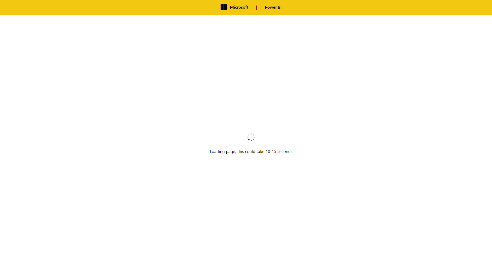
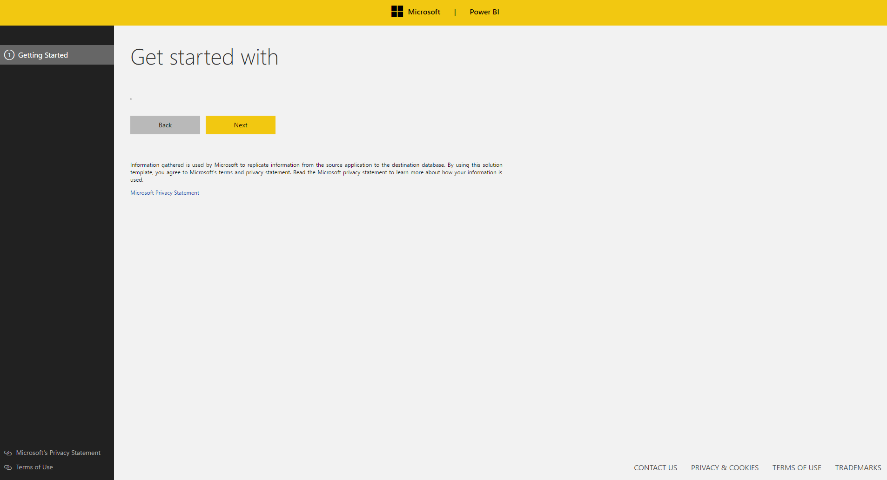

# Creating Solution Templates

1. [Overview](#Overview)
2. [Set up a developer build](#devbuild)
3. [Tutorials](#tutorials) --
   [Tutorial 1](#tutorial1)


# Overview <a name="Overview"></a>

The solution template framework allows you to quickly and easily create your own templates or applications. 
These templates can provision multiple components including Azure Services such as Logic Apps, Azure Functions 
or Azure SQL, third party SaaS services such as Scribe and Informatica, or utilize On-Prem applications and services 
such as SQL Server, Task Scheduler or Simplement. The framework is split into five components. 

## UI Wizard (Pages) 
In order to provision a template, a template will usually require critical information from the user such as credentials 
to third party applications or customizations for the template. The UI layer is made up a list of pages which are designed 
to guide the user through a wizard like experience to collect and validate the information they enter. This information will 
be used to help provision resources by either collecting credentials, server information or choosing customizations for the 
template being deployed. 

## Deployment Actions (Actions)
An action is simply a task which is executed. An action can serve two purposes; 
•	either it performs a validation such as checking for credentials or 
•	provisioning a resource such as Azure SQL or Azure Functions. 
Once a user has reached the final page in the wizard, they will be shown a list of actions which when executed in order provision 
successfully an End-to-End instantiation of the solution. 

## Data Store
The data store is effectively a vault which stores all the session information. The datastore is passed across the UI pages 
and actions. All actions usually depend on information stored inside the vault i.e. the get databases action will require the 
database name and server information be inside the datastore to succeed. The UI will usually collect these details from the user 
and insert them into the data store but actions can also insert data into the data store. An example of an action is the Azure login 
action which inserts the azure token directly into the data store for subsequent actions to use. 

## Manifest file(init.json)
The glue which holds the templates together is a JSON file which defines which pages should be rendered and which actions should be 
executed on the final page. There is a lot of functionality available inside the JSON file which we will covered later such as adding 
items into the datastore, executing actions on next or on validate, and setting javascript variables.

Today, the framework has a list of Pages and Actions which can be shared and reused between templates without any coding required. 
The great news is, if there is a feature missing or if you wish to customize an existing page, add a new UI Page or action we have samples available which guides you through this. 
They require minimal coding and it is super easy to integrate into a new template. The great news is we are constantly adding to this list and the team is constantly listening for 
feedback on which ones we should prioritize next. 


# Setting up your machine <a name="devbuild"></a>
-- Visual Studio 2015 Update 3 required
-- Node JS Tools
-- Set Node to the path variable
-- Install git for windows

## Project structure
(Coming soon)

<br/>

# Tutorials <a name="tutorials"></a>
All the tutorials are saved in the Source/Apps/SampleApps location. in order to create a new App, your App folder must contain a file called init.json, this registers the app during build and deployment. Before getting started, make sure you can sucessfully build the project and ensure when you run the project you are shwon the following snippet

to run a tutorial or navigate to a template, when you debug the web project (found inside DeploymentAppService solution) Navigate to localhost:1503/?name=Tutorial1. the name parameter defines which solution template do you wish to load

## Tutorial 1 <a name="tutorial1"></a>
To create a new template create an init.json file underneat a folder name. ensure the foldername is unique as the foldername will decide the template name. 

Copy and paste the following text in the contents of the init.json

```json
{
  "Install": {
    "Pages": [
      {
        "name": "$SiteCommon$/pagesgallery/getting-started.html",
        "displayname": "Getting Started"
      }
    ]
  }
}
```


Lets break down the init.json. the ```Install``` tag tells the framework
that we are describing the process for the installation flow. the other supported  flow is uninstall

Next comes ```Pages``` the pages tag is an array of all the pages you wish to show to the user. a page
is usually designed to collect information from the user such as credentials or customizations. the pages themselves are 
made from HTML and Typescript. The ```name``` tag defines the path of the page. in general, alot of the pages are available for you to consume from the pages gallery.
The list of pages in the pages gallery is always growing and can be found in Source/SiteCommon/Web/PagesGallery. in this case the $SiteCommon$ refers to the SiteCommon/Web folder.


Finally the ```displayname``` tag is used to define the freindly name that appears in the navigation menu when you navigate to the website.

Debug the Web project and you should be shown the website below load



Navigate to Tutorial 1 (http://localhost:1503/?name=Tutorial1)
You will now be shown a window which  loads a default getting started page.


You have now sucessfully created your first template.