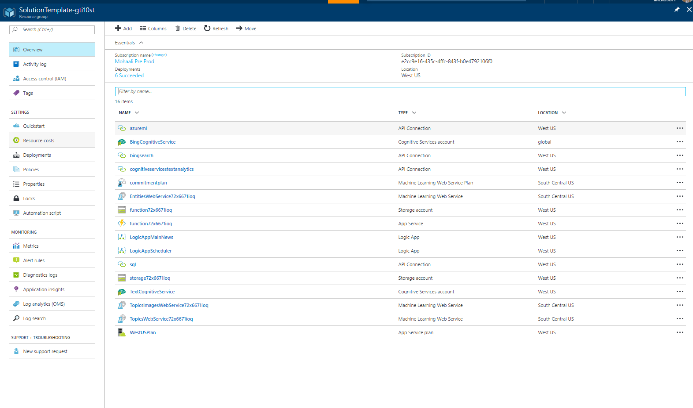

Advanced Search with Bing News Solution Template Documentation
===========================================================

# Table of Contents
1. [Introduction](#introduction)
2. [Architecture](#architecture)
3. [System Requirements](#system-requirements)
4. [How to Install](#how-to-install)
5. [Architecture Deep Dive] (#architecture-deep-dive)
6. [Model Schema] (#model-schema)
7. [Reports Walkthrough](#report-walkthrough)
8. [Customizations](#customizations)
9. [Pricing] (#pricing)

### Introduction

The Bing News template spins up a sophisticated search solution, finding you the most relevant articles using machine learning techniques. The template stands up an end-to-end solution that finds articles via the Bing News API, enriches the data using machine learning and stores these enrichments in Azure SQL. Users can then use pre-built Power BI reports that leverage Microsoft research technology to start exploring the data and finding articles most relevant to them.
The template is aimed at anyone who is interesting in finding articles relevant to their chosen search query. It supports multiple personas ranging from a product manager keeping a pulse on the market to a ministry official interested in tracking the media’s reactions to recent policy announcements.
The following document provides a walkthrough of the architecture, a deep dive into every component, comments on customizability as well as information on additional topics like estimated costs. For any questions not covered in this document, please contact the team at <PBISolnTemplates@microsoft.com>

### Architecture

The flow of the Bing News solution template is as follows:

-   Logic Apps finds articles via the Bing News API

-   Logic App 

-   Azure Function enriches tweet and writes it to Azure SQL

-   Azure Function also calls textual analytics cognitive service to work out sentiment of tweet

-   Power BI imports data into it from Azure SQL and renders pre-defined reports

#System Requirements

Setting up the template requires the following:

-   Access to an Azure subscription

-   Power BI Desktop (latest version)

-   Power BI Pro (to share the template with others)

-   Twitter Account

#How to Install

Before diving into the components of the solution, we will go through how to set things up. To get started with the solution, navigate to the [Bing News template page]( https://powerbi.microsoft.com/en-us/solution-templates/bing-news/) and click **Install Now**.

**Getting Started:** Starting page introducing the template and explaining the architecture.

**Azure:** Use OAuth to sign into your Azure account. You will notice you have a choice between signing into an organizational account and a Microsoft (work/school account).

If you select a Microsoft account, you will need to provide the application with a domain directory. You can find your domain by logging into your Azure account and choosing from those listed when you click your e-mail in the top right hand corner:

If you belong to a single domain, simply hover over your e-mail address in the same place:

In this case, the domain is: richtkhotmail.362.onmicrosoft.com.

Logging into Azure gives the application access to your Azure subscription and permits spinning up Azure services on your behalf. It also lists the estimated costs of the template. If you want a more granular breakdown of the costs, please scroll down to the Estimated Costs section.
As a user navigates away from this page a new resource group gets spun up on their Azure subscription (the name is random but always prefixed by ‘SolutionTemplate-‘). This name can be changed under the advanced settings tab. All newly created resources go into this container.
**Cognitive Services:** Cognitive services are an Azure service that provide unique machine learning capabilities. This solution template uses the Text Analytics API to enrich data through sentiment analysis and key phrase extractions. It also uses the Bing News Search API to find articles based on the user’s search query.

Upon clicking next on the “Connect to Cognitive Services” page you may run into the following error:
 
Your account admin (xxxx@yyyy.zzz) needs to enable cognitive services for this subscription. Ensure the account admin has at least contributor privileges to the Azure subscription. The following cognitive service should be enabled in order to proceed- TextAnalytics --- Action Failed Microsoft-RegisterCognitiveServices --- Error ID: (yuu0gk0pdevkt3knk)
 
This occurs when:
•	the Azure cognitive services APIs required by the solution template are not enabled
•	the solution template attempts to enable the required cognitive services on the user’s behalf, and
the individual provisioning the Bing News solution template does not have permissions to enable the Cognitive Services required by the solution template.

To fix this, your Azure account administrator needs to enable the cognitive services required by the Bing News solution template. The alias of your account administrator is included in the error message. Contact this individual and ask him or her to do the following:

1.	Connect to the Azure portal.
2.	Click the search icon on the top center, enter “Cognitive”, and click on “Cognitive Services accounts (preview)”
3.	Click the Add button
4.	In the “API Type” field, select “Bing Search APIs”
5.	Select the “API Setting”. You should see the following:

6.	 Select “Enable” and then “Save"
7.	 Repeat steps 4-6 but with “API Type” selected as “Text Analytics API (preview)”
 
Note that it is possible that an account administrator might not have permissions to enable these Cognitive Services (it is possible that they delegated this to the subscription administrator). If this occurs, then the subscription administrator must assign “Contributor” permissions to the account admin for the subscriptions.

**Target:** Connect to an existing SQL Server or provide details which the application will use to spin up an Azure SQL on your behalf. Only Azure SQL is supported for this template. If a user chooses to spin up a new Azure SQL, this will get deployed in their Azure subscription inside the newly created resource group.

**Search Terms:** Input the search terms you are interested in tracking. Articles that match your search terms will be found using the Bing News cognitive service via the Logic App. Logic Apps supports any queries that the Bing News API supports. You can preview your search results [here]( https://www.microsoft.com/cognitive-services/en-us/bing-news-search-api).
Some recommended practices are as follows:
If you would like to look for multiple search words please use the OR operators (e.g. Microsoft OR Azure)
If you would like to look for a specific phrase please use quotation marks (e.g. “Surface Pro”)
If you would like to exclude a word from your search pleas use – (e.g. Azure -Color)
If you would like to learn how you can change your search terms once the solution is deployed, please look at the ‘Customizations’ section.

**Summary:** Summary page outlining all the choices the user made.

**Deploy:** When you navigate to the deployment page the setup process gets kicked off. The following steps take place (we will do a deep dive into all of these resources):
-	SQL scripts run to create the necessary tables, views and stored procedures
-	Azure Functions get spun up
-	Storage accounts gets spun up
-	Azure ML commitment plan get spun up and the web services get deployed
-	Cognitive services get deployed
-	2 Logic Apps get spun up

**It is important that you do not navigate away from this page while deployment takes place. This process could take 10-15 minutes** Once everything gets deployed a download link will appear for a Power BI file which consists of the pre-defined reports.

**Power BI File:** Once you download the Power BI desktop file you will need to connect it to your data. Open the pbix and follow the instructions on the front page (**it is important you do this before publishing the file to the Power BI Service. If this is not done the solution will not work inside the Service).**

Architecture Deep Dive
======================

The following section will break down how the template works by going through all the components of the solution.

Azure Resources:
----------------

You can access all of the resources that have been spun up by logging into the Azure portal. Everything should be under one resource group (unless a user was using an existing SQL server. In this case the SQL Server will appear in whatever resource group it already existed in).

Here is an example of what gets spun up for a user. We will go through each of these items one by one.

### Estimated Costs

Here is an estimate of the Azure costs (Logic Apps, Azure Functions, Azure SQL, Azure ML, Cognitive Services) based on the number of articles processed:

Processing 10K articles a month will cost approximately $420

Processing 50K articles a month will cost approximately $875

Processing 100K articles a month will cost approximately $1443

Please keep in mind these are estimated costs and subject to change. For a more detailed breakdown of the various components please refer to the [Azure calculator](https://azure.microsoft.com/en-us/pricing/calculator/) and select Logic App, Azure Function, Azure SQL, Cognitive Services and Azure ML. You can tweak all the options to see what the costs will look like and what modifications may suit your needs best.

The following defaults are set for you in the template (you can modify any of these after things get set up):

-   Azure SQL: Standard S1

-   App Service Plan: Dynamic

-   Logic App 1 (trigger set for every 15 minutes), 14 actions executed

-   Logic App 2 (trigger set for every 3 hours), 7 actions executed

-   Azure Functions (approximately 30 seconds run per article)

-   Azure ML (S1)

-   Cognitive Services – Text Analytics S1

-   Cognitive Services – Bing Search S2

For example, if you know you will be processing very few articles a month, you could change the SQL Server from S1 to Basic. 
Whilst the default setting should cater to most news template requirements, we encourage you to familiarize yourself with the various pricing options and tweak things to suit your needs.

