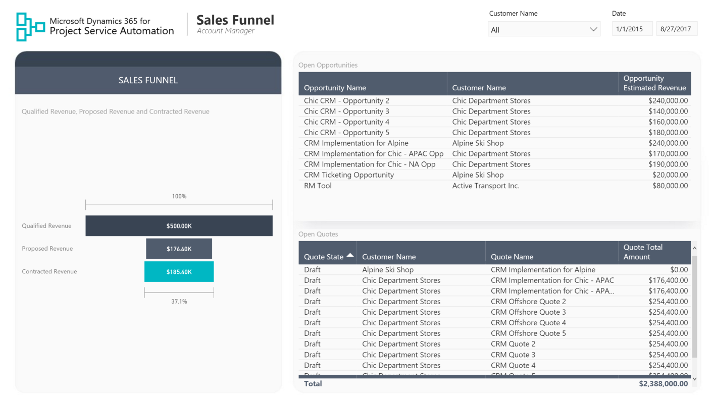
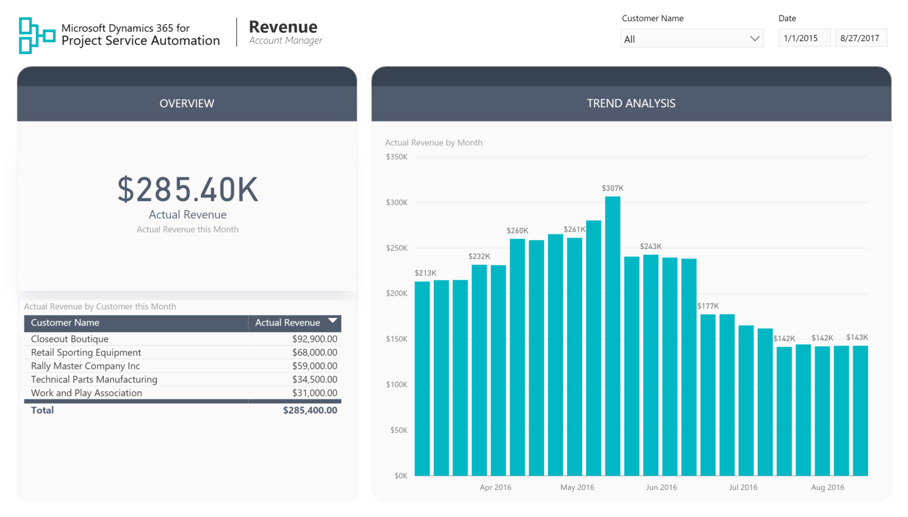
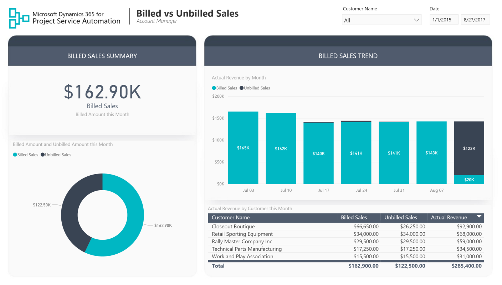
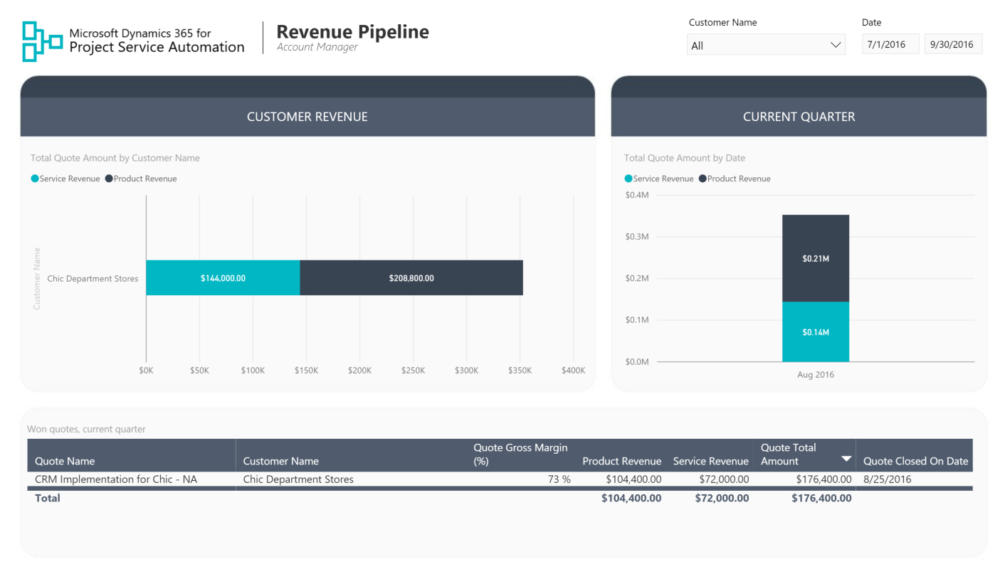
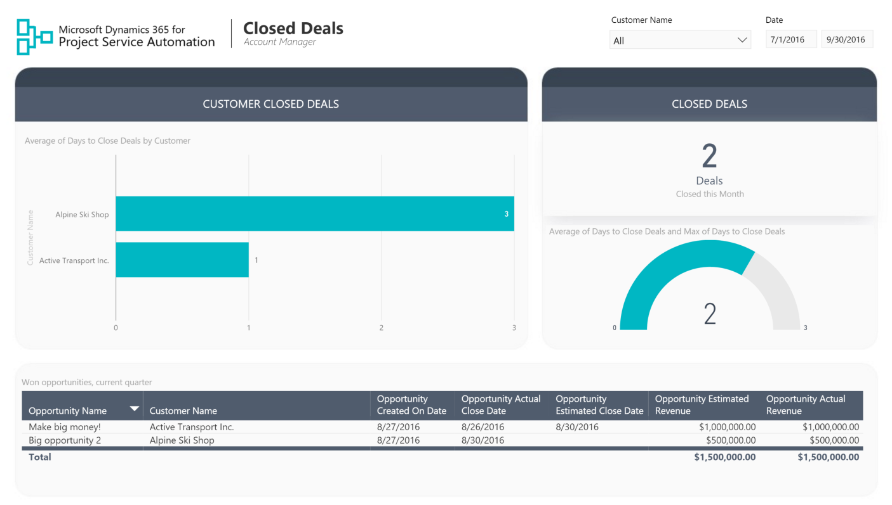
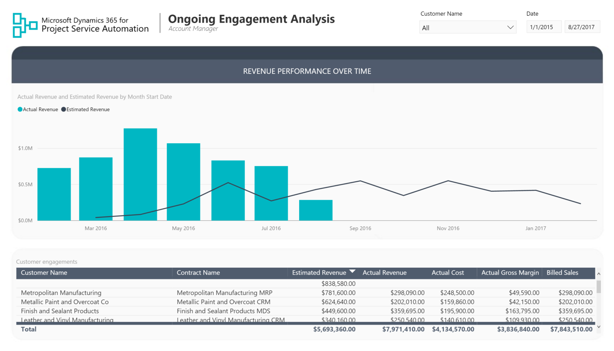
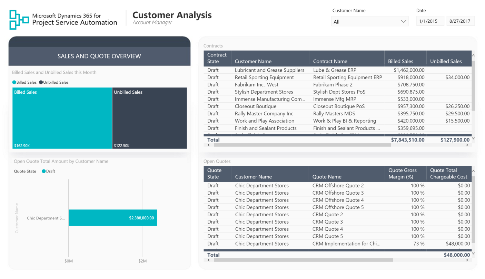

Account Manager Reports
===========================================================

# Table of Contents
1. [The Account Manager Persona](#account-manager-persona)
2. [Report Pages](#report-pages)
3. [Sales Funnel](#system-sales-funnel)
4. [Actual Revenue](#actual-revenue)
5. [Billed vs Unbilled Sales](#billed-vs-unbilled-sales)
6. [Revenue Pipeline](#revenue-pipeline)
7. [Closed Deals](#closed-deals)
8. [Ongoing Engagement Analysis](#ongoing-engagement-analysis)
9. [Customer](#customer)

### The Account Manager Persona

The main responsibility of the account manager in a professional services company is driving revenue from the customers. This can be hard to achieve without having insights into how overall customer engagements are going. The PSA Account Manager report template serves as foundation for building Power BI reports to getting those insights.

### Report Pages

### Sales Funnel

This report page gives visual overview of the potential sales revenue by different stages (initial opportunity estimate, quoted amount, contracted amount).

### Actual Revenue

This report page gives an overview of current month revenue numbers and allows for comparison with the previous months.

### Billed vs Unbilled Sales

This report page displays which portion of revenue has been billed to the customer this month and how much is remaining to be billed.

### Revenue Pipeline

This report page gives an overview of the revenue structure for the winning quotes closed this quarter and gives insight into the portion of the revenue coming from products vs. services.

### Closed Deals

This report page gives an overview of closed deals and helps answer questions about the number of days it takes to close

### Ongoing Engagement Analysis

This report page shows details of ongoing customer engagements, how each contract is performing, and the actual and estimated revenue numbers from the deals.

### Customer

On this report page, the account manager can find a detailed overview of each customer. This page can help answer the questions about the active contracts and quotes for the customer along with which portion of sales has been billed and which one remains to be billed.

