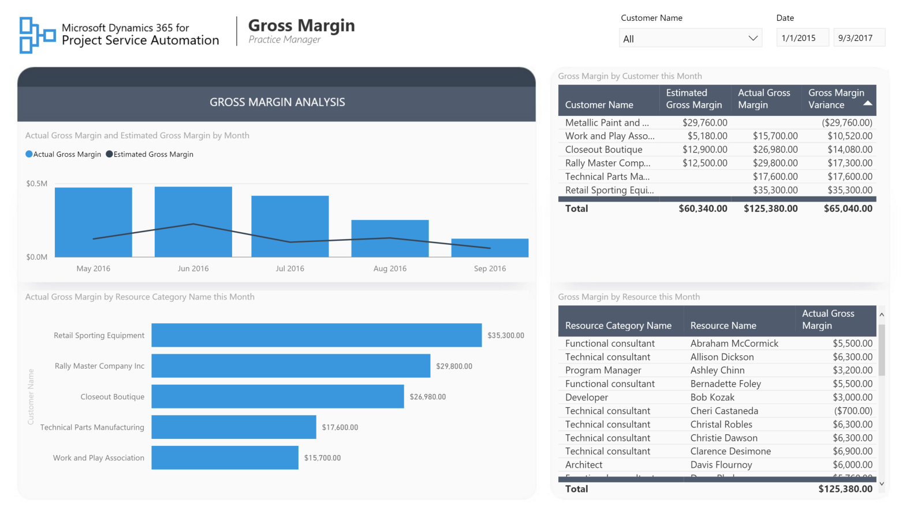
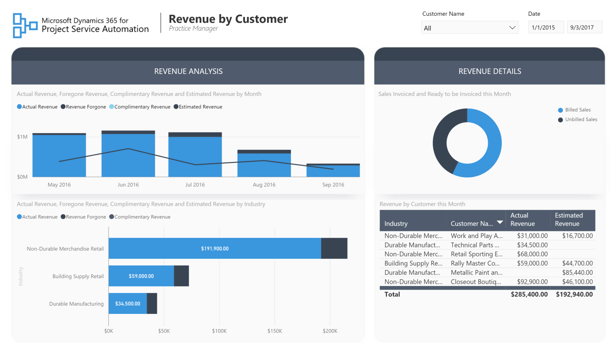
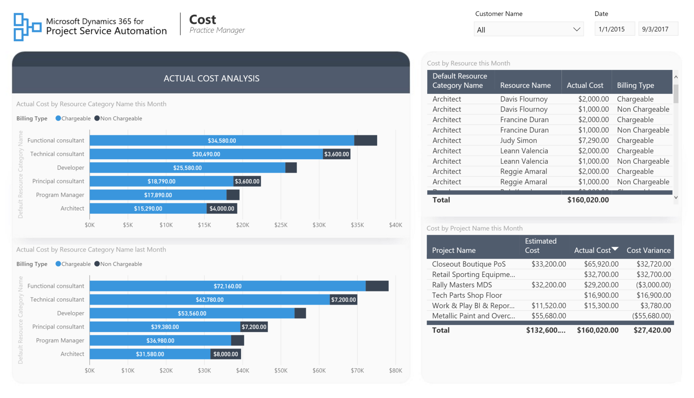
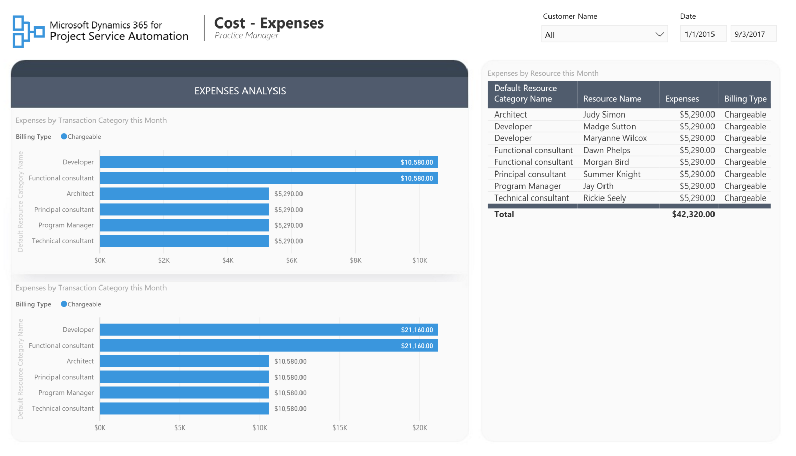
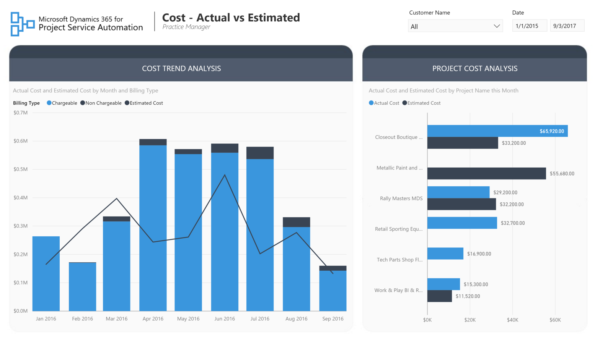
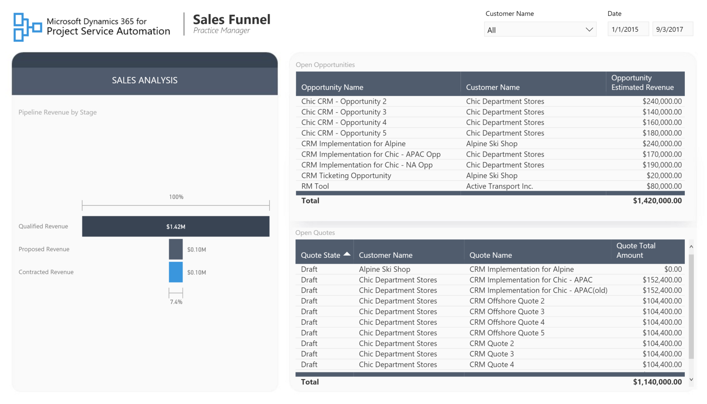
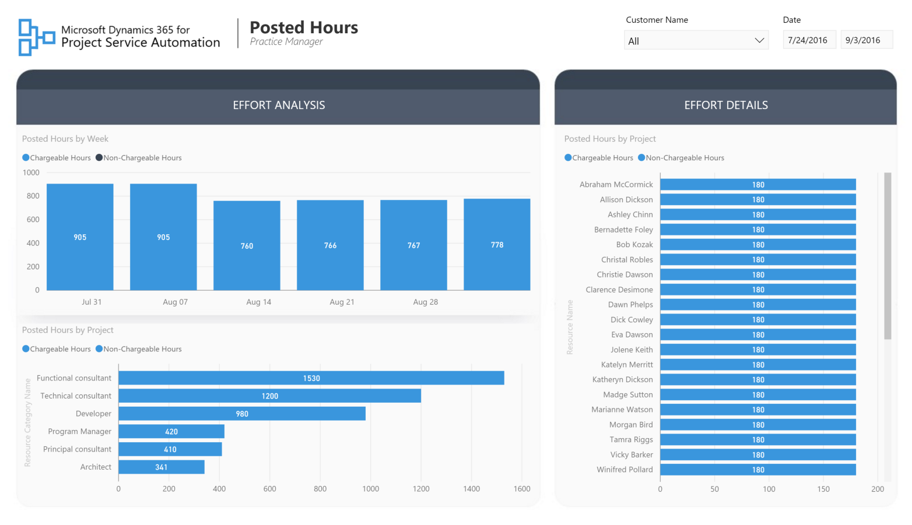
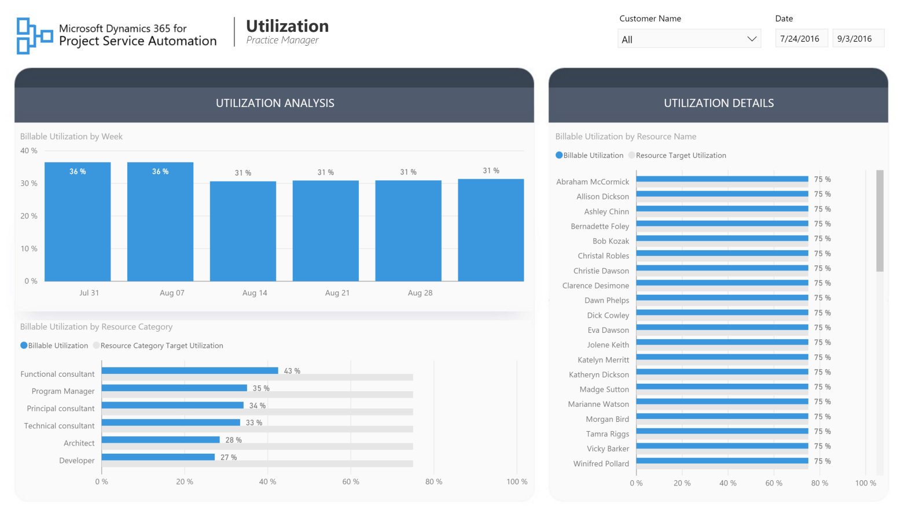
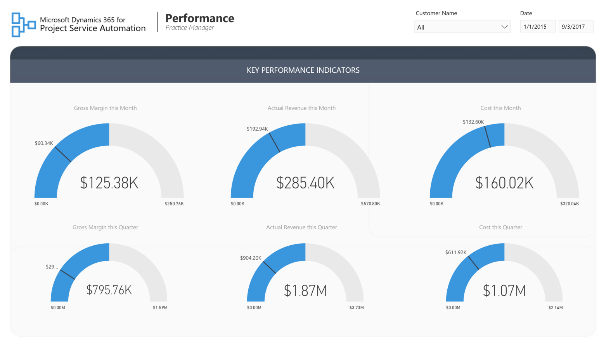

Account Manager Reports
===========================================================

# Table of Contents
1. [The Practice Manager Persona](#practice-manager-persona)
2. [Report Pages](#report-pages)
3. [Gross Margin](#gross-margin)
4. [Revenue by Customer](#revenue-by-customer)
5. [Revenue by Resource](#revenue-by-resource)
6. [Cost](#cost)
7. [Cost – Expenses](#cost–expenses)
8. [Cost – Actual vs Estimated](#cost-actual-vs-estimated)
9. [Sales Funnel](#sales-funnel)
10. [Posted Hours](#posted-hours)
11. [Utilization](#utilization)
12. [Performance](#Performance)

### The Practice Manager Persona

The practice manager in a professional services company manages the performance of their practice to ensure it is profitable, growing, and delivering projects that delight customers. The practice manager sets the financial and business goals for the practice and develops the strategy to grow the practice. Practice manager is ultimately responsible for revenue goals, project completion, and customer satisfaction for all service engagements delivered.
The PSA Practice Manager report template serves as the foundation for building Power BI reports that help practice managers successfully perform their job duties.

### Report Pages

### Gross Margin

This report page gives an overview of the practice’s gross margin by various dimensions and helps answer the questions about who is the most profitable customer, which resources bring the most profits and how we are trending compared to our estimates.

### Revenue by Customer

This report page gives insight into the revenue generated from customers and helps answer the questions about monthly revenue trends, the industries and customers that bring the most revenue to the company and the status of billings to customers.

### Revenue by Resource

This report page helps answer the questions about how much revenue was brought in by different resource roles, project managers and individual resources. 

### Cost

This report page allows practice managers to track costs associated with running the projects and give answers to where the costs are incurred and which incurred costs can be charged to the customers.

### Cost- Expenses

This similar to the previous cost report page, this report page focuses exclusively on expenses part of costs incurred on projects.

### Cost – Actual vs Estimated

This report page allows the practice manager to review trends for incurred project costs and compare those to estimates.

### Sales Funnel

This report page gives a visual overview of the potential sales revenue by different stages (initial opportunity estimate, quoted amount, contracted amount).

### Posted Hours

This report page allows for the analysis work hours posted by resources during the execution of projects and details their chargeability to the customer.

### Utilization

This report page gives an overview of resource utilization. Here, the practice manager can find answers to questions about how far we are from target utilization for particular resource roles and individual resources, who are the most and the least utilized resources and resource utilization trends.

### Performance

This report page contains a set of KPIs for monitoring the performance of the practice.

