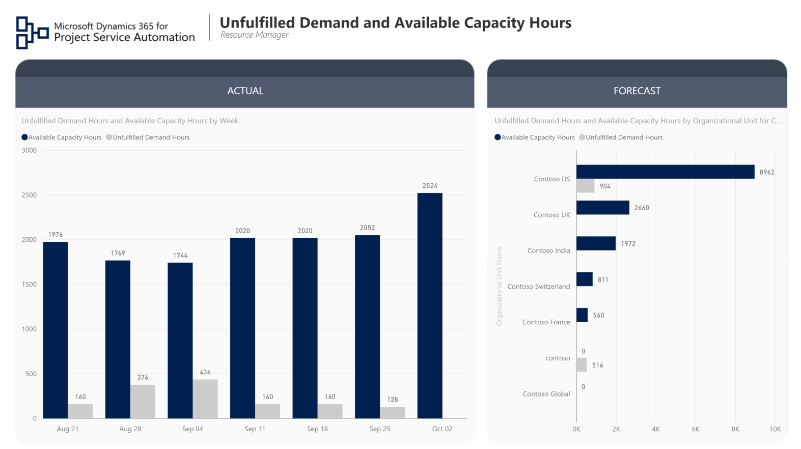

Account Manager Reports
===========================================================

# Table of Contents
1. [The Resource Manager Persona](#resource-manager-persona)
2. [Report Pages](#report-pages)
3. [Resource Utilization and Forecasts](#resource-utilizations)
4. [Role Utilization and Forecasts](#role-utilizations)
5. [Unfulfilled Demand](#unfulfilled-demand)
6. [Revenue Pipeline](#revenue-pipeline)
7. [Closed Deals](#closed-deals)
8. [Ongoing Engagement Analysis](#ongoing-engagement-analysis)
9. [Customer](#customer)

### The Resource Manager Persona

The resource manager in a professional services company is responsible for assigning right resources to the right projects at the right time, making sure that the company has enough capable resources with the right skills available for the upcoming projects.
The PSA Resource Manager report template serves as the foundation for building Power BI reports that help resource managers deal with their daily tasks.

### Report Pages

### Resource Utilization and Forecasts

This report page gives an overview of how individual resources are being utilized in the company. It displays side by side, billable utilization for last the 6 weeks and the number of hard booked hours for the next 6 weeks per each individual resource. The slicers give the resource manager the ability to focus on specific resource roles and organizational units.

### Role Utilization and Forecasts

This report page gives an overview of current month revenue numbers and allows for comparison with the previous months.

### Unfulfilled Demand

This report page gives an overview of unfulfilled demand for resources and can give insight into how many resource hours requested and if there is enough resource capacity available to fulfill those requests. The data is sliced by resource role, organizational unit and week.

