SAP Accounts Receivable Solution Template Documentation
-------------------------------------------------------------------

# Table of Contents

1. Introduction
2. Architecture
3. System Requirements
4. How to Install
5. Technical Description
6. Report Walkthrough

**Introduction**

Get a handle on your SAP Accounts Receivable in Power BI with a scalable and extensible solution that requires minimum set up and maintenance considerations.  The data is pulled daily from SAP and stored in a database where it can later be imported to create powerful Power BI reports.  You can extend or customize the result to accommodate your own business requirements.  The Accounts Receivable solution template is intended for customers who:

- Want to provision an analytics solution for a wide range of users.
- Want to deploy an analytics solution that scales with any size of SAP instance, from small to very large
- Want to be able to create an insightful Power BI dashboard with data from their SAP system that can be targeted to financial comptrollers and accounting managers so they can monitor cash flow, track and compare receivables throughout time.

This document describes how to set up the Accounts Receivable solution template, the architecture and how to customize the template.  The audience for this document is intended to be the IT professional or administrator who implements and manages the solution template and/or the developer who extends or customizes the solution template.

Please contact [PBISolnTemplates@microsoft.com](mailto:PBISolnTemplates@microsoft.com) for any questions or issues with this document.

# Architecture

The solution template is supported by the following architecture:

- Import data into Power BI

Under this simple import option, the data is pulled out of the SQL database to populate the model in Power BI.  On every refresh, all the data is pulled out of the SQL database to refresh the Power BI model.  When the model is published to Power BI, the data will be resident in the Power BI service.

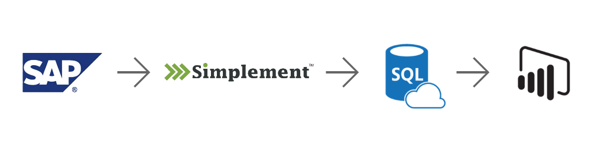

# System Requirements

To set up this solution template you will need the following:

- SQL Server Database 2008 R2 or later
-  Azure Subscription (to use Azure SQL).  Template supports SQL on premises too.
- Power BI Desktop (latest version)
- Power BI Pro (needed if you want to publish and share the template with your organization)

# How to Install

Download the installer from the Solution Templates web page (available form PowerBI.com).

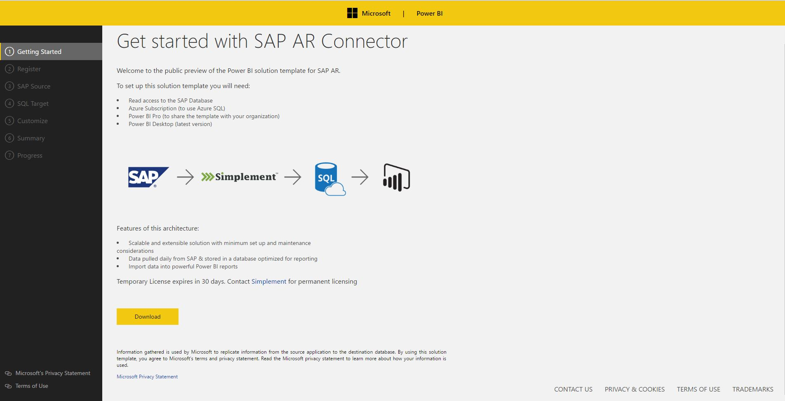

## Step 1:
Once you have downloaded and run the installer from the above URL you will see a screen like this. Press Install to continue.

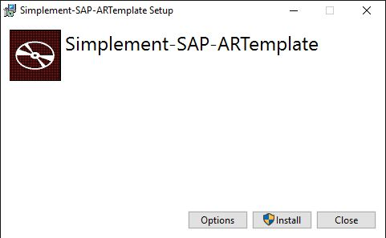

# Step 2:

You will encounter a registration screen after the installer finishes. Fill out the screen like the sample data shown below. This is to register with Simplement.

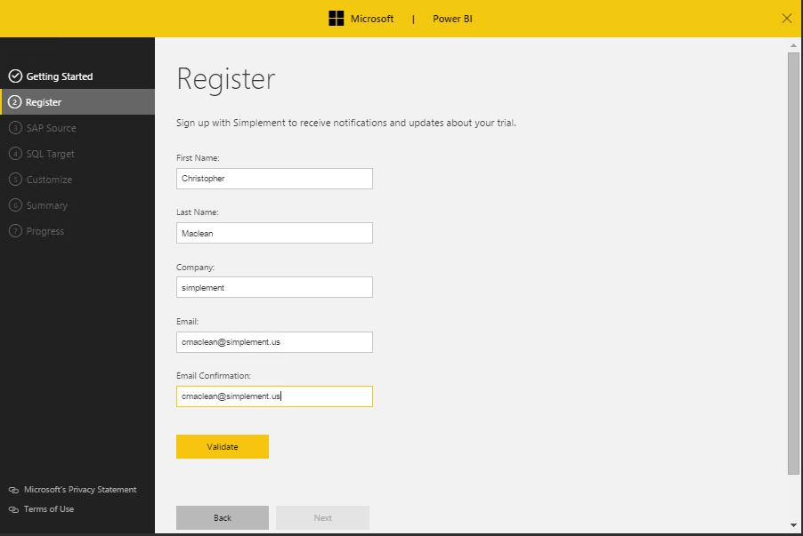

## Step 3:
It is important that this screen is filled out with the correct information so that the solution template is
pointed to the correct SAP source with valid SAP login credentials.  Use the validate button to ensure the connection info entered is valid.

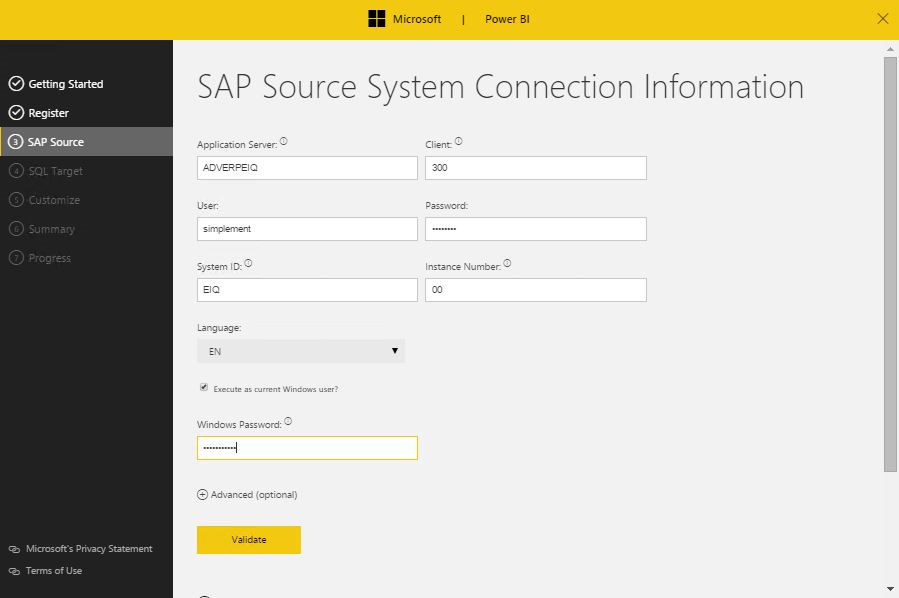

## Step 4:

Provide SQL server target connection information where the information pulled from SAP will be retained. Windows authentication or SQL login authentication can be used here.
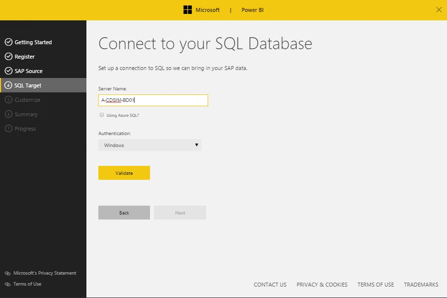

## Step 4 (cont.):

Once you have successfully validated the connection to the SQL server you will now be prompted to select the desired target database from the dropdown list. Note that there must be a preexisting database, the installer will not create one.

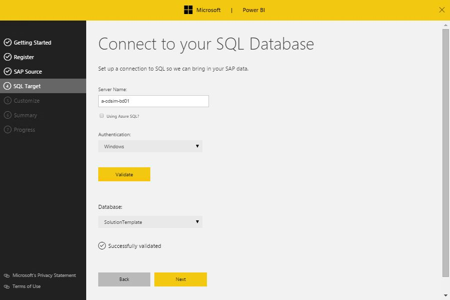

## Step 5:

On this screen you simply choose the hour of the day for the extraction job to execute at. The default is 2:00 AM. 

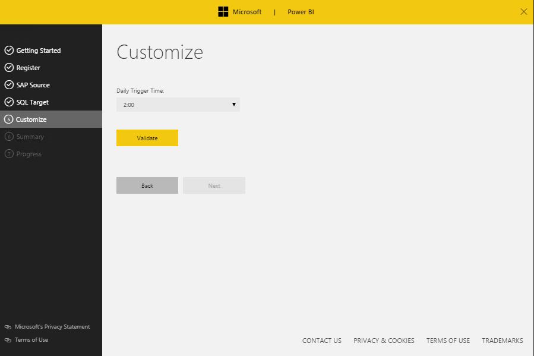

## Step 6:

This pages prompts you to verify that the target SQL server are database are correct. When you press run the extraction process will begin immediately and will then execute according to the schedule set in the previous step.

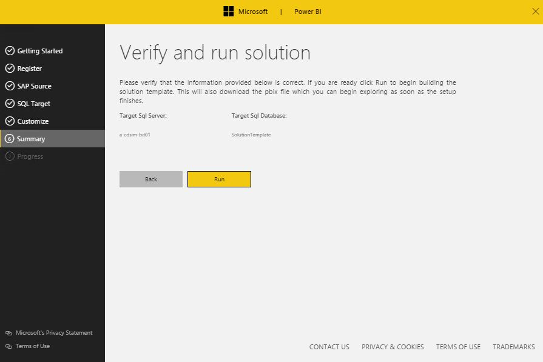

## Step 7:

This last page will indicate that the extraction process has begun and also provide a direct link to download the PowerBI .pbix file that come with the Solution Template. You can open the reports immediately but keep in mind that it might take several minutes for the data to extract into the SQL target and appear in the .pbix file.

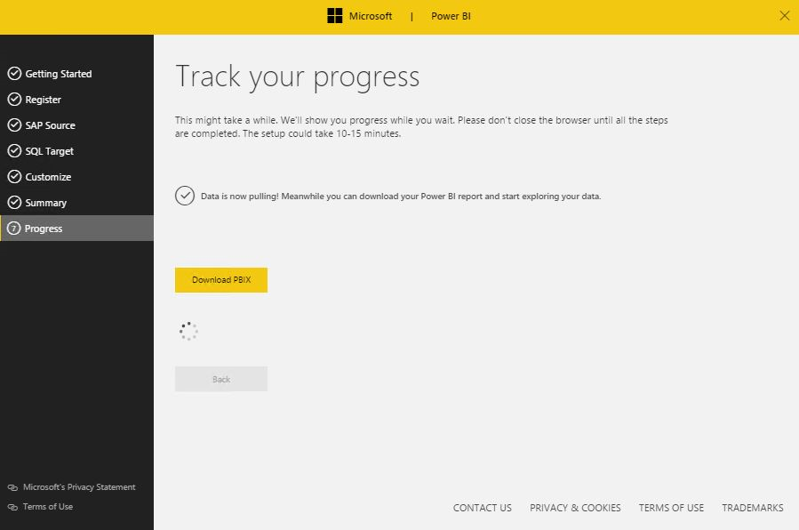

# Technical Description 

## Client Data Extraction and Load

The data is pulled from the SAP source via RFC extractor on the schedule determined in the above steps. The data is inserted into tables and views in the SQL target also specified above. Lastly the pbix file pulls the data from the views into a data model and generates the reports for the end users.

The executable is executed from Task Scheduler. To change or pause the schedule, open Task Scheduler and locate the Task "Power BI Solution Template - SCCM". 

The same data is pulled with each load. Destination database stored procedures merge the results.

## Understanding Credentials for Accessing the SCCM and Target Databases

The task requires credentials to be able to access the SCCM and for the target databases. These credentials are securely stored with
Credential Manager.

You can manually manage the credentials for both the SCCM and target database after the solution template
is provisioned. To change the windows credentials used to access the SCCM DB and target database, open task
scheduler, find the task "Power BI Solution Template - SCCM" and change the task's credentials.

To change the credentials used to access the target database when SQL Authentication was used, open Credential Manager (open Control Panel and search for Credential Manager), and edit the credential "pbi_sccm".

# Report Walkthrough

The purpose of this section is to go through the Accounts Receivable solution template. 

As an important financial metric for businesses that has a direct impact in a company’s cash flow, Accounts Receivables needs to be frequently monitored by financial comptrollers and accounting managers to make sure that invoices are being paid in accordance to the time frame agreed. 

Financial managers are interested in tracking receivables because it is an important component when calculating a company’s profitability and income.  When analyzing them, it is imperative to keep an eye on basic metrics such as: accounts receivable balances, number of invoices outstanding, aging buckets and customers past due, among others. This allows executives and managers to answer key business questions and help them make faster decisions in order to shorten the cash cycle by implementing proactive practices in collecting its debt. 

The next few pages will provide an overview of each page of the Accounts Receivable solution template reports.  They include a high level description of the information contained as well as screenshots. 

## Accounts Receivable Overview

The purpose of the Accounts Receivable Overview report is to provide a high level summary of receivable totals.  That way the user can easily identify which customers/companies need attention by looking at balances. 

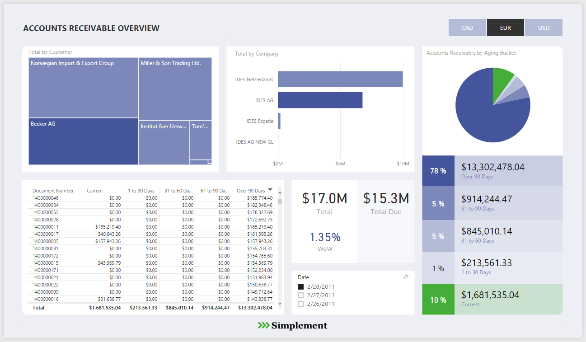

The report provides accounts receivable totals by customer, company and by document number.  Totals are also segregated into aging metrics ranging from current to over 90 days.  The ‘Accounts Receivable by Aging Bucket’ view helps quickly identify the amount owed to the company in terms of total and percentage of total.  Filtering options based on currency and point in time date are available to facilitate the analysis.  

## Accounts Receivable Time Travel

The purpose of the Accounts Receivable Time Travel report is to portray receivable balances by individual customers.  
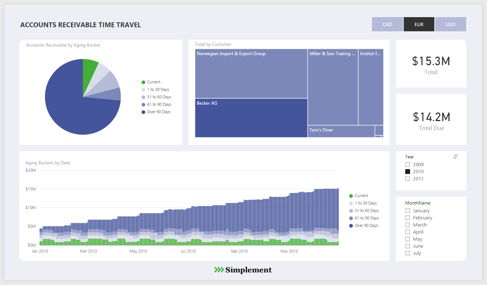

The report provides a focused view on customer balances, allowing the user to take an in depth look at individual customers.  It also contains aging buckets by date that can be quickly drilled down to see the details of a customer balance and visually identify trends over time.  Filtering options based on currency and point in time date are available to facilitate the analysis.  

## Accounts Receivable Time Travel-Over 90 days
The report is aimed to present any company’s most pressing over 90 receivables by customer.

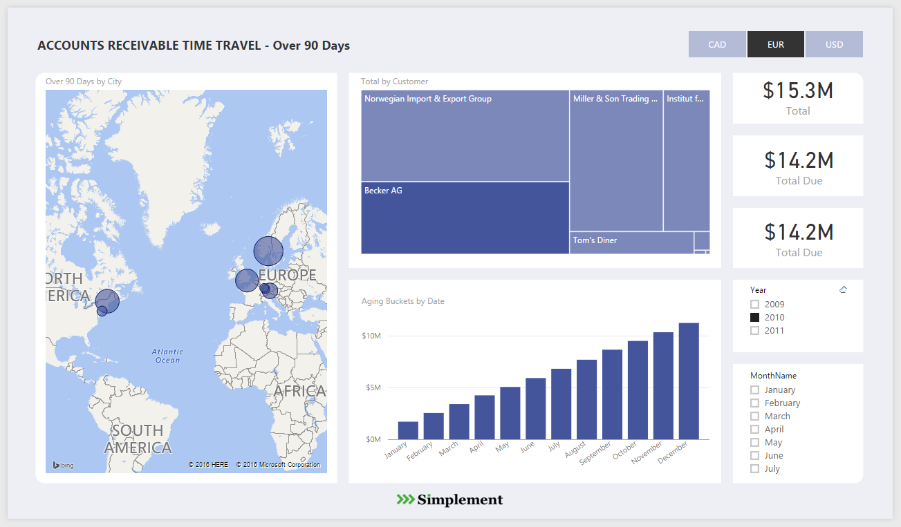

It concentrates on providing relevant information about customers with accounts receivables over 90 days past due.  By including interactive visuals (map), the user can immediately identify geographical areas where the worse receivables are located.  The report also includes an ‘Aging Bucket by Date’ chart with a drill down feature that allows to identify ‘over 90 days’ trends over time and helps to take action from there. Filtering options based on currency and point in time date are available to facilitate the analysis.  

## Accounts Receivable %

The report focuses on providing information of the receivable aging bucket as a percentage of total amount. 

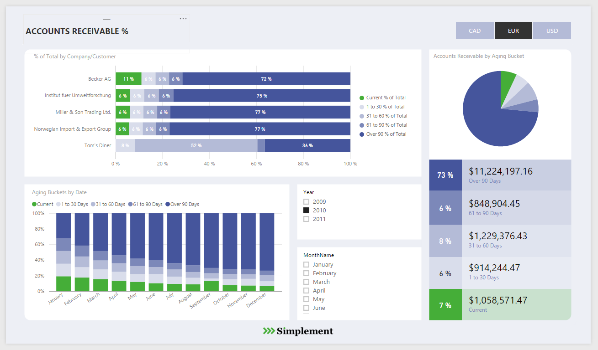

The receivable aging buckets by percentage of total amount can be seen by company or by customer.  Whereas, the charts provide insightful information about aging buckets at any point in time, helping the user to identify trends and allow for better and more accurate business decisions.  Filtering options based on currency and point in time date are available to facilitate the analysis.  
Each of the reports, as described before, come with filtering and drill down options that allows for an interactive and a more in depth data analysis.  Also, a color scheme was added for the user to easily make reference and identify receivables health, the green color being representative of current accounts receivable and the darkest shades of receivables being over 90 days. 
Accounts Receivable solution template design is based on shapes inside Power BI, providing flexibility to the end user so it can modify the size and colors of graphs contained in each page, as well as font size and visualization type.  Background color can also be changed and image or logo can be added. Under the right side panel labeled as “Format”, the user will find various options that allows template personalization. 
